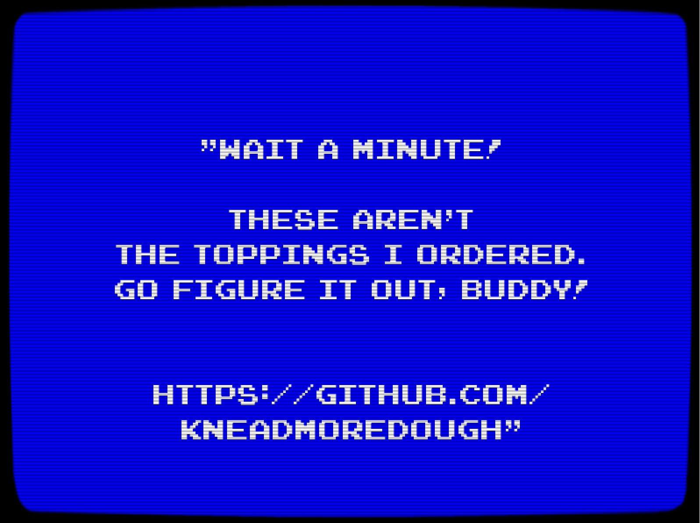

# Challenge 2

This is the second of three challenges for The Last Slice: An old-school algorithmic word find, with a twist. Download the code and run the project. Request a puzzle, and solve it with code. Each puzzle is unique and expires 30 seconds after it's issued. You can request as many puzzles as you need.

## The Prerequisites

Here's what you'll need to get started:

 * A Windows 10 PC
 * Beat [challenge 1](https://github.com/TheLastSliceGame/TheLastSliceGame)
 * Use [Visual Studio 2017](http://bit.ly/LastSliceVS)

## The Problem

You've beaten [challenge 1](https://github.com/TheLastSliceGame/TheLastSliceGame). But upon delivering the final pizza and beating the retro 8-bit game, you've discovered that the pizza you delivered has the wrong ingredients. Oh, no!

Your task is to find and submit the correct ingredients. You'll know you've succeeded when you receive a unique coupon code. (Hang on to that coupon code...you'll need it later, and we'll let you know when.)

## The Reward

Solve this challenge before midnight UTC on July 17, 2018 and you'll be qualified to participate in the third and final challenge (which will begin on August 18, 2018). The first five participants to solve challenge 3 will each win $10,000 USD.

Who will nab the last slice?

## License

Copyright (c) Microsoft Corporation. All rights reserved.

Licensed under the [MIT](LICENSE.txt) License.
